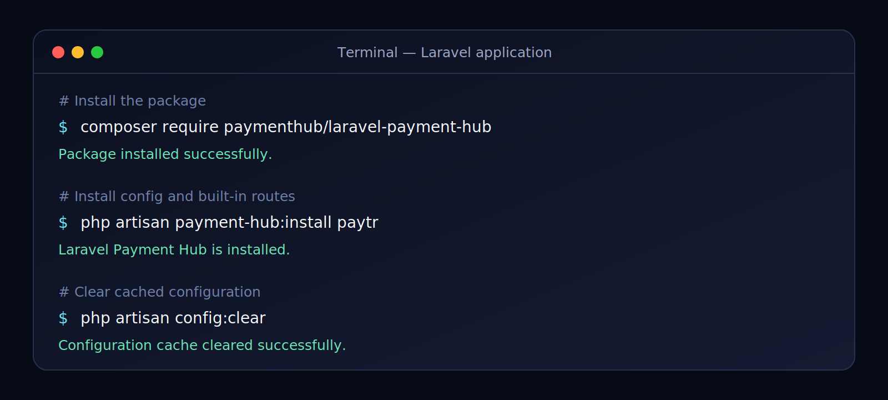
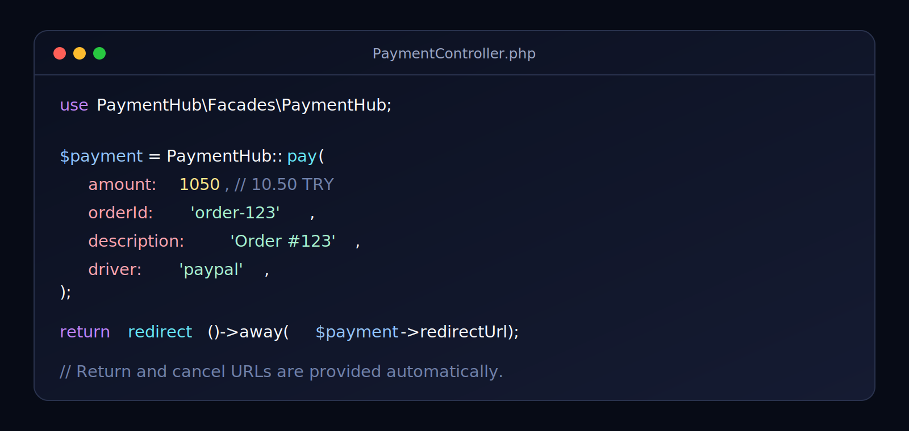

# Laravel Payment Hub

Laravel Payment Hub provides one consistent interface for working with multiple
payment providers in Laravel 11, 12, and 13 applications.

## Supported providers

- Stripe Payment Intents
- PayPal Orders and Captures
- Iyzico Checkout Form
- PayTR iFrame API
- Worldline Hosted Checkout
- Adyen Pay by Link
- SIX Payment Services / Saferpay Payment Page
- Datatrans Payment Page
- Payrexx Gateway

## Requirements

- PHP 8.2 or later
- Laravel 11, 12, or 13
- Guzzle 7.9 or later

## Quick start

Install the package and run its installer:

```bash
composer require paymenthub/laravel-payment-hub
php artisan payment-hub:install all
```

The `all` installer displays the credentials for every provider. Fill only the
providers you plan to use and select the default one with `PAYMENT_PROVIDER`:

```dotenv
PAYMENT_PROVIDER=paytr
PAYTR_MERCHANT_ID=xxxxxx
PAYTR_MERCHANT_KEY=xxxxxxxxxxxxx
PAYTR_MERCHANT_SALT=xxxxxxxxxxxxx
PAYTR_SANDBOX=true
```

Create a payment without importing or constructing a DTO:

```php
use PaymentHub\Facades\PaymentHub;

$payment = PaymentHub::pay(
    amount: 1050,
    orderId: 'order-123',
    description: 'Order #123',
    customer: [
        'ip' => request()->ip(),
        'email' => 'customer@example.com',
        'name' => 'Ada Lovelace',
        'address' => 'Example Street 1',
        'phone' => '+905551112233',
    ],
);

return redirect()->away($payment->redirectUrl);
```

The package automatically generates an order ID when `orderId` is omitted and
automatically uses its built-in return and cancel routes.

Installing every provider does not contact or create accounts at those
providers. It publishes one configuration file and prepares all `.env` keys;
each provider becomes usable when its own credentials are filled in.

## Installation

### Install from Packagist

Once the package has been published to Packagist, run this command inside your
Laravel application:

```bash
composer require paymenthub/laravel-payment-hub
php artisan payment-hub:install stripe
```



### Install from a local directory

If the package has not been published yet, place the Laravel application and
package directories next to each other:

```text
projects/
├── my-laravel-app/
└── laravel-payment-hub/
```

Run the following commands from the Laravel application directory:

```bash
composer config repositories.payment-hub path ../laravel-payment-hub
composer require paymenthub/laravel-payment-hub:@dev
php artisan payment-hub:install stripe
```

The service provider is registered through Laravel package discovery, so you do
not need to add it manually.

## Built-in routes

The package registers these routes automatically:

| Method | URL | Route name |
| --- | --- | --- |
| `GET` | `/payment-hub/success` | `payment-hub.success` |
| `GET` | `/payment-hub/cancel` | `payment-hub.cancel` |
| `POST` | `/payment-hub/iyzico/callback` | `payment-hub.iyzico.callback` |
| `GET` | `/payment-hub/paypal/return` | `payment-hub.paypal.return` |
| `POST` | `/payment-hub/paytr/callback` | `payment-hub.paytr.callback` |

Configure the PayTR merchant panel callback URL as:

```text
https://your-domain.com/payment-hub/paytr/callback
```

## Handle payment callbacks

Verified Iyzico, PayPal, and PayTR callbacks dispatch a
`PaymentCallbackReceived` event. Create a listener in your Laravel application:

```bash
php artisan make:listener UpdateOrderPaymentStatus
```

Handle the package event in the listener:

```php
<?php

namespace App\Listeners;

use App\Models\Order;
use PaymentHub\Events\PaymentCallbackReceived;
use PaymentHub\Support\PaymentStatus;

final class UpdateOrderPaymentStatus
{
    public function handle(PaymentCallbackReceived $event): void
    {
        $order = Order::where('payment_id', $event->paymentId)->first();

        if ($order === null) {
            return;
        }

        $order->update([
            'payment_status' => $event->status->value,
            'paid_at' => $event->status === PaymentStatus::Succeeded
                ? now()
                : null,
        ]);
    }
}
```

Callback notifications may be delivered more than once. Make the listener
idempotent and do not fulfill the same order twice.

## Publish the configuration manually

The install command publishes the configuration automatically. To publish it
manually, run:

```bash
php artisan vendor:publish --tag=payment-hub-config
```

This creates `config/payment-hub.php` in your application. Clear the config
cache after changing the configuration or `.env` file:

```bash
php artisan config:clear
```

## Provider configuration

Select the default provider in your `.env` file:

```dotenv
PAYMENT_PROVIDER=stripe
```

Supported values are `stripe`, `iyzico`, `paytr`, `paypal`, `worldline`,
`adyen`, `saferpay`, `datatrans`, and `payrexx`.

To print every provider's `.env` template at once, run:

```bash
php artisan payment-hub:install all
```

### Stripe

```dotenv
PAYMENT_PROVIDER=stripe
STRIPE_SECRET=sk_test_xxxxxxxxxxxxx
STRIPE_WEBHOOK_SECRET=whsec_xxxxxxxxxxxxx
STRIPE_CAPTURE_METHOD=automatic
```

Set `STRIPE_CAPTURE_METHOD=manual` to enable manual capture.

### Iyzico

```dotenv
PAYMENT_PROVIDER=iyzico
IYZICO_API_KEY=xxxxxxxxxxxxx
IYZICO_SECRET_KEY=xxxxxxxxxxxxx
IYZICO_SANDBOX=true
IYZICO_LOCALE=en
```

### PayTR

```dotenv
PAYMENT_PROVIDER=paytr
PAYTR_MERCHANT_ID=xxxxxx
PAYTR_MERCHANT_KEY=xxxxxxxxxxxxx
PAYTR_MERCHANT_SALT=xxxxxxxxxxxxx
PAYTR_SANDBOX=true
PAYTR_LOCALE=en
```

### PayPal

```dotenv
PAYMENT_PROVIDER=paypal
PAYPAL_CLIENT_ID=xxxxxxxxxxxxx
PAYPAL_CLIENT_SECRET=xxxxxxxxxxxxx
PAYPAL_SANDBOX=true
PAYPAL_CURRENCY=USD
```

### Worldline

```dotenv
PAYMENT_PROVIDER=worldline
WORLDLINE_MERCHANT_ID=your_pspid
WORLDLINE_API_KEY=xxxxxxxxxxxxx
WORLDLINE_API_SECRET=xxxxxxxxxxxxx
WORLDLINE_SANDBOX=true
WORLDLINE_CURRENCY=EUR
WORLDLINE_LOCALE=en_GB
```

### Adyen

```dotenv
PAYMENT_PROVIDER=adyen
ADYEN_API_KEY=xxxxxxxxxxxxx
ADYEN_MERCHANT_ACCOUNT=YourMerchantAccount
ADYEN_CURRENCY=EUR
ADYEN_BASE_URL=https://checkout-test.adyen.com/v72
```

For live payments, set `ADYEN_BASE_URL` to the live Checkout API URL assigned
to your Adyen account.

### SIX Payment Services / Saferpay

```dotenv
PAYMENT_PROVIDER=saferpay
SAFERPAY_CUSTOMER_ID=xxxxxxxx
SAFERPAY_TERMINAL_ID=xxxxxxxx
SAFERPAY_USERNAME=API_xxxxxxxx
SAFERPAY_PASSWORD=xxxxxxxxxxxxx
SAFERPAY_SANDBOX=true
SAFERPAY_CURRENCY=CHF
```

The installer also accepts `php artisan payment-hub:install six`, but the
driver name stored in `.env` is `saferpay`.

### Datatrans

```dotenv
PAYMENT_PROVIDER=datatrans
DATATRANS_MERCHANT_ID=xxxxxxxx
DATATRANS_PASSWORD=xxxxxxxxxxxxx
DATATRANS_SANDBOX=true
DATATRANS_CURRENCY=CHF
DATATRANS_AUTO_SETTLE=true
```

### Payrexx

```dotenv
PAYMENT_PROVIDER=payrexx
PAYREXX_INSTANCE=your-instance
PAYREXX_API_SECRET=xxxxxxxxxxxxx
```

Use only the instance name. For example, enter `example` for
`example.payrexx.com`.

## Monetary values

All monetary values are integers expressed in the currency's smallest unit.
Floating-point amounts are not used.

```text
10.50 TRY = 1050
25.00 USD = 2500
100 JPY   = 100
```

## Create a payment

```php
<?php

use PaymentHub\DTO\PaymentRequest;
use PaymentHub\Facades\PaymentHub;

$payment = PaymentHub::createPayment(new PaymentRequest(
    orderId: 'order-123',
    amount: 1050,
    currency: 'TRY',
    description: 'Order #123',
    customer: [
        'email' => 'customer@example.com',
    ],
    metadata: [
        'cart_id' => 42,
    ],
    returnUrl: route('payments.success'),
    cancelUrl: route('payments.cancel'),
));

return response()->json([
    'payment_id' => $payment->id,
    'status' => $payment->status->value,
    'redirect_url' => $payment->redirectUrl,
]);
```



`PaymentResponse` contains these properties:

- `id`: The provider payment or session identifier
- `status`: The normalized payment status
- `amount`: The amount in the currency's smallest unit
- `currency`: The ISO currency code
- `redirectUrl`: The hosted payment URL, when a redirect is required
- `raw`: The complete response returned by the provider

## Select a specific driver

You can select a driver without changing the default provider in `.env`:

```php
$gateway = PaymentHub::driver('paypal');
$payment = $gateway->createPayment($request);
```

With the simple API, select a provider separately for each order:

```php
$payment = PaymentHub::pay(
    amount: 4990,
    currency: 'EUR',
    orderId: 'order-1001',
    driver: 'adyen',
);
```

This does not change the global default. Another request can use
`driver: 'worldline'`, `driver: 'payrexx'`, or any other configured provider.

## European hosted checkout usage

Worldline, Adyen, Saferpay, Datatrans, and Payrexx use the same simple call:

```php
use PaymentHub\Facades\PaymentHub;

$payment = PaymentHub::pay(
    amount: 4990,
    currency: 'EUR',
    orderId: 'order-1001',
    description: 'Order #1001',
);

return redirect()->away($payment->redirectUrl);
```

The selected provider comes from `PAYMENT_PROVIDER`. The built-in success and
cancel routes are supplied automatically. Store `$payment->id` on the order so
you can retrieve its status later:

```php
$payment = PaymentHub::getPayment($storedPaymentId);

if ($payment->status->value === 'succeeded') {
    // Mark the order as paid. In production, confirm this from a webhook too.
}
```

Adyen refunds use the payment PSP reference received from an Adyen webhook,
not the payment-link ID. Worldline refunds use the payment ID returned when the
hosted checkout status is retrieved. Saferpay starts with a payment-page token;
`getPayment()` returns the resulting transaction ID after checkout.

## Stripe usage

Stripe returns the PaymentIntent `client_secret` in the raw response. Send it
to your frontend securely and use Stripe.js to complete the payment:

```php
$payment = PaymentHub::driver('stripe')->createPayment($request);

return response()->json([
    'payment_id' => $payment->id,
    'client_secret' => $payment->raw['client_secret'] ?? null,
]);
```

When Stripe is the default provider and manual capture is enabled:

```php
$payment = PaymentHub::capturePayment($paymentIntentId);
```

## PayPal usage

Create a PayPal order and redirect the customer to the approval URL:

```php
$payment = PaymentHub::driver('paypal')->createPayment($request);

return redirect()->away($payment->redirectUrl);
```

After the customer approves the order, capture it. The following example
assumes PayPal is the default provider:

```php
$payment = PaymentHub::capturePayment($paypalOrderId);
```

PayPal refunds require a capture ID, not an order ID.

## Iyzico usage

Iyzico requires buyer and address information:

```php
$customer = [
    'id' => 'customer-1',
    'name' => 'Ada',
    'surname' => 'Lovelace',
    'identity_number' => '11111111111',
    'email' => 'ada@example.com',
    'phone' => '+905551112233',
    'address' => 'Example Street 1',
    'city' => 'Istanbul',
    'country' => 'Turkey',
    'zip_code' => '34000',
    'ip' => request()->ip(),
];

$payment = PaymentHub::driver('iyzico')->createPayment(
    new PaymentRequest(
        orderId: 'order-123',
        amount: 1050,
        currency: 'TRY',
        description: 'Order #123',
        customer: $customer,
        returnUrl: route('payments.iyzico.callback'),
    )
);

return redirect()->away($payment->redirectUrl);
```

Use the Checkout Form token from the Iyzico callback to retrieve the final
payment result:

```php
$payment = PaymentHub::driver('iyzico')->getPayment(
    (string) request('token')
);
```

You may also provide `shipping_address`, `billing_address`, and
`metadata.basket_items` arrays.

## PayTR usage

PayTR requires customer information when creating the iFrame token:

```php
$customer = [
    'ip' => request()->ip(),
    'email' => 'customer@example.com',
    'name' => 'Ada Lovelace',
    'address' => 'Example Street 1',
    'phone' => '+905551112233',
];

$payment = PaymentHub::driver('paytr')->createPayment(
    new PaymentRequest(
        orderId: 'order-123',
        amount: 1050,
        currency: 'TRY',
        description: 'Order #123',
        customer: $customer,
        returnUrl: route('payments.success'),
        cancelUrl: route('payments.cancel'),
    )
);

return redirect()->away($payment->redirectUrl);
```

Custom PayTR basket rows can be supplied through `metadata.basket_items` using
the `[product name, decimal price, quantity]` format:

```php
metadata: [
    'basket_items' => [
        ['Product 1', '10.50', 1],
        ['Product 2', '25.00', 2],
    ],
],
```

A redirect to the success URL does not guarantee that the payment is complete.
Confirm the result through the PayTR callback or a server-side status request
before fulfilling the order:

```php
$payment = PaymentHub::driver('paytr')->getPayment('order-123');
```

## Retrieve a payment

```php
$payment = PaymentHub::getPayment($providerPaymentId);

if ($payment->status->value === 'succeeded') {
    // Mark the order as paid.
}
```

Possible payment statuses are:

- `pending`
- `requires_action`
- `succeeded`
- `failed`
- `cancelled`
- `partially_refunded`
- `refunded`

## Refund a payment

```php
use PaymentHub\DTO\RefundRequest;
use PaymentHub\Facades\PaymentHub;

$refund = PaymentHub::refund(new RefundRequest(
    paymentId: $providerPaymentId,
    amount: 500,
    metadata: [
        'currency' => 'TRY',
    ],
));
```

Pass `amount: null` to request a full refund. Providing `metadata.currency` is
recommended for partial PayPal refunds.

## Error handling

```php
use PaymentHub\Exceptions\GatewayException;
use PaymentHub\Exceptions\PaymentHubException;

try {
    $payment = PaymentHub::createPayment($request);
} catch (GatewayException $exception) {
    report($exception);

    return back()->withErrors([
        'payment' => $exception->getMessage(),
    ]);
} catch (PaymentHubException $exception) {
    report($exception);
}
```

`GatewayException::$providerCode` contains the provider error code and
`GatewayException::$context` contains its error response. The context may
include payment or personal data and should not be displayed directly to users.

## Register a custom gateway

```php
use PaymentHub\Contracts\PaymentGateway;
use PaymentHub\PaymentHub;

app(PaymentHub::class)->extend(
    'custom',
    fn (array $config): PaymentGateway => new CustomGateway($config),
);
```

## Testing the package

Run these commands inside the package directory:

```bash
composer install
composer test
```

## License

Laravel Payment Hub is open-source software licensed under the MIT license.
